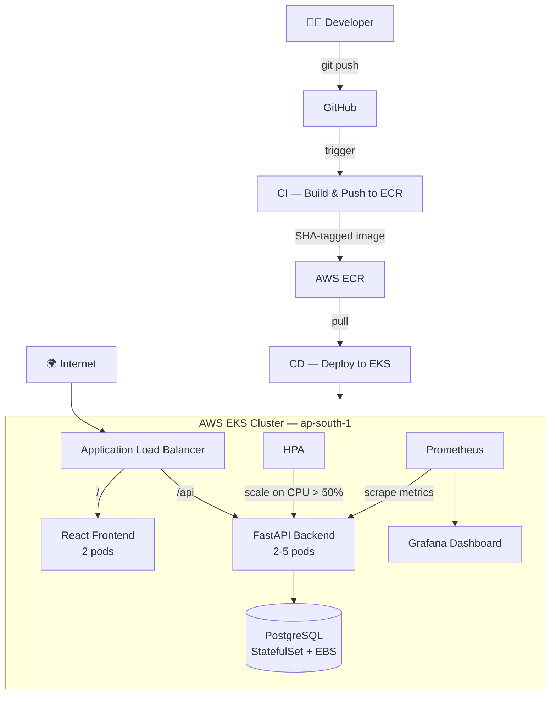
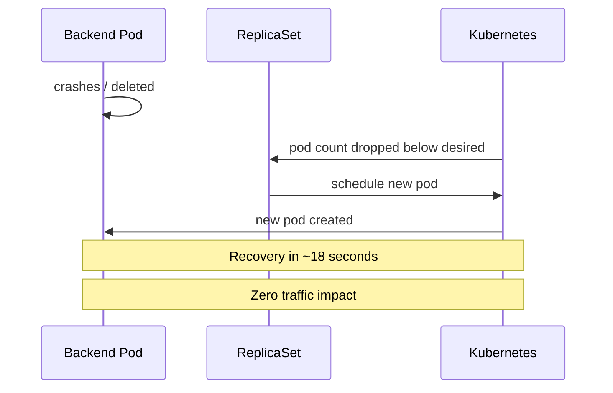
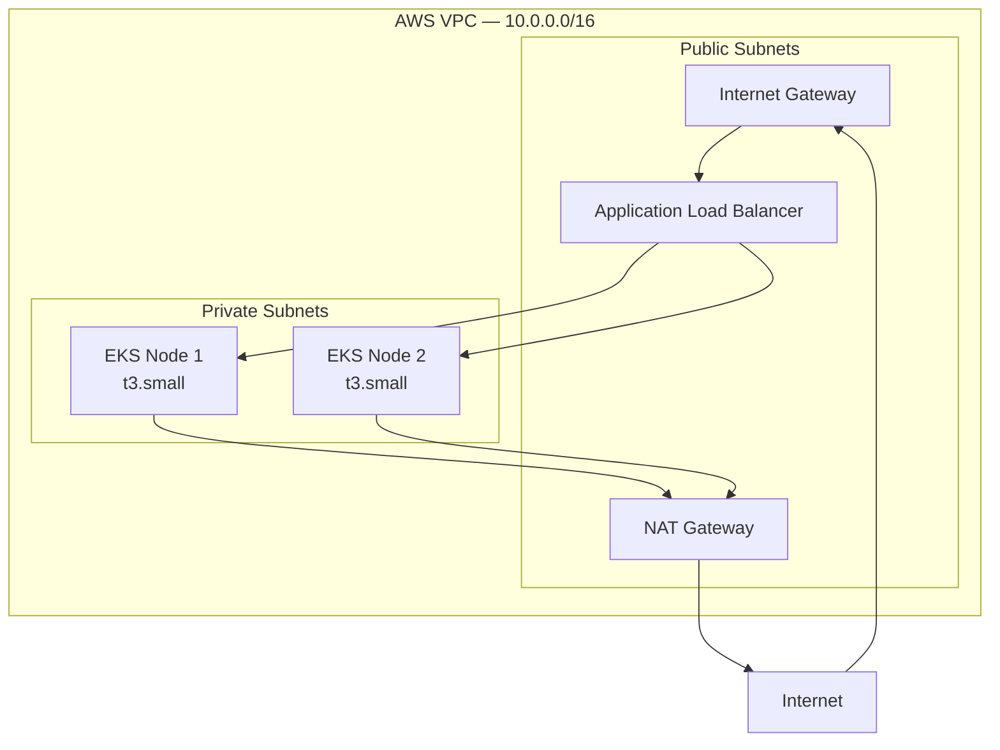

# KubeWatch — CareerLens on Kubernetes

> Self-healing, auto-scaling full-stack app on AWS EKS with Terraform IaC, GitHub Actions CI/CD, and Prometheus/Grafana observability.

[](https://github.com/gaus13/careerlens/actions)

---

## Architecture



---

## Tech Stack

| Category | Technology |
|----------|-----------|
| App | React + FastAPI + PostgreSQL |
| Registry | AWS ECR |
| Orchestration | Kubernetes on AWS EKS v1.31 |
| IaC | Terraform |
| CI/CD | GitHub Actions |
| Monitoring | Prometheus + Grafana + Alertmanager |
| Networking | AWS VPC + ALB + NAT Gateway |
| Storage | AWS EBS via CSI Driver |

---

## CI/CD Pipeline

```mermaid
flowchart LR
    A[git push] --> B[GitHub Actions CI]
    B --> C[Build Images]
    C --> D[Tag with Git SHA]
    D --> E[Push to ECR]
    E -->|CI passes| F[GitHub Actions CD]
    F --> G[Connect to EKS]
    G --> H[kubectl set image]
    H --> I[Rolling Update]
    I --> J[Verify Pod Health]
    J --> K[✅ Live]
```



---

## Self-Healing Flow



---

## AWS Infrastructure



---

## Results

### Chaos Engineering
| Experiment | Recovery | Impact |
|------------|----------|--------|
| Kill 1 backend pod | ~18 sec | Zero |
| Kill ALL pods | ~25 sec | Auto-recovery |
| OOM Kill (10Mi limit) | ~10 sec | Auto restart |
| Bad liveness probe | CrashLoopBackOff | Backoff |
| HPA load test | ~60 sec | 2→5 pods |

### HPA Load Test
| Phase | CPU | Pods |
|-------|-----|------|
| Idle | 3% | 2 |
| Load start | 73% | 3 |
| Peak | 152% | 5 (max) |
| After load | 3% | 2 |

Scale up: ~60s · Scale down: ~5min (stabilization window)

---

## Monitoring Dashboard


**5 Custom Panels:** Pod Restarts · CPU Usage · Memory (MB) · Pod Count · Node CPU %

---

## Quick Start

```bash
# 1. Create infrastructure
cd terraform && terraform apply

# 2. Connect kubectl
aws eks update-kubeconfig --name careerlens --region ap-south-1

# 3. Deploy app
kubectl apply -f k8s/

# 4. Install monitoring
helm install monitoring prometheus-community/kube-prometheus-stack \
  --namespace monitoring --create-namespace \
  --values monitoring/prometheus-values.yaml

# 5. Access Grafana
kubectl port-forward -n monitoring service/monitoring-grafana 3000:80
# http://localhost:3000 → admin / careerlens123

# 6. Destroy when done (saves ~$4.58/day)
cd terraform && terraform destroy
```

---

## Repository Structure

```
careerlens-k8s/
├── k8s/                    # Kubernetes manifests
├── terraform/              # AWS infrastructure (IaC)
├── monitoring/             # Prometheus + Grafana config
├── .github/workflows/      # CI/CD pipelines
├── screenshots/            # Dashboard + evidence
└── RUNBOOK.md              # Incident response guide
```

---

## Cost Estimate

| Resource | Cost/Day |
|----------|---------|
| EKS Control Plane | $2.40 |
| 2× t3.small nodes | $1.10 |
| NAT Gateway | $1.08 |
| **Total** | **~$4.58** |

> Always run `terraform destroy` when done!

---

**Built by [Danish](https://github.com/gaus13) · B.Tech CSE**
